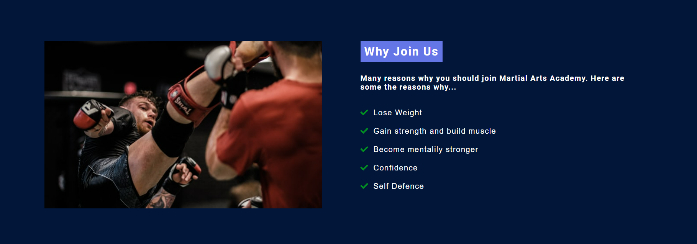
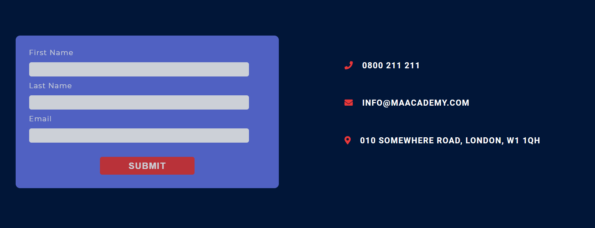
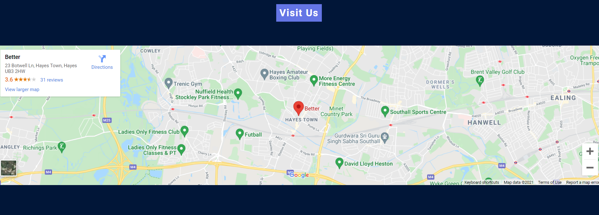
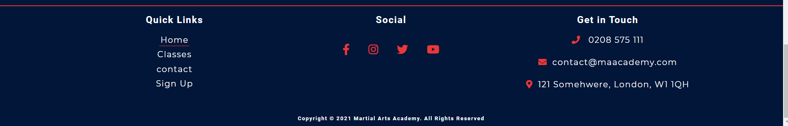

# Martial Arts Academy

Martial Arts Academy is a site for experienced and new martial arts practitioners. Main purpose of the site is to enable users to view the latest classes available, check times of classes and sign up. It list all classes and time so users can easily find classes to fit around their schedule.

# Features

* Navigation Bar

    * The Navigation Bar allow users to navigate the site easily. 
    * Navigation Bar is fully responsive on all devices.
    * Links include Home, Classes, Contact and Sign Up pages.
    * Logo is linked to the home page so users can return to home page in one click.

 

* Home Hero Image and Text

    * The image is fully responsive. 
    * Highlights what the website is about.
    * Has text overlay with call to action button.
    * Sub Header text allows user to understand what the website is about and see discount available.
    
     

    

* Benefits Section

    * This section is aimed at motivating users to take up Martial Arts by undertstanding the benefits.
    * It outlines sone of the benefits of what users can gain if they start Martial Arts.
    * Image is there to motivate users and encourage them to take action.

     

    

* Popular classes and Classes

    * This section shows users MA Academy's classes.
    * It is aimed at getting users to see what classes are available so they can join at time suitable to them.
    * Users can see the times of the classes.
    * Users can see who the instructor is in each class.

     

    

* Instructors

    * Users can see MA Academy's Instructors.
    * Images of the Instructors and brief information area.
    * Show which classes they do.

     

    

* Contact Form section

    * Users can easily fill out the contact form and contact the gym.
    * User can see direct contact details of the gym on the right hand side of the page.
    * Address is shown so users can visit the gym.

     

    

* Contact Page Map

    * In this section users can easily see map view of the gym location.
    * Users can visit the gym more easily with the map view as they have visual look of the gym location.
    * Link takes users directly to Google Maps in new window.

     

    

* Sign Up Section

    * This section users can easily sign up to the gym.
    * Log In button for existing users.

     

    

* Footer 

    * In this section users can navigate to all the pages available on the site.
    * Users can visit MA Academy to Social media accounts from the Social Icons.
    * There is also contact information of the Academy so users can contact the gym easily.

     

    

# Features Left to Implement

* Add videos to the website of Martial Arts classes.
* Testimonial section.

# Wireframes

* [Desktop](https://github.com/dushanka-dev/martial-arts-academy/tree/main/readme-files/wireframes/desktop)
* [Tablet](https://github.com/dushanka-dev/martial-arts-academy/tree/main/readme-files/wireframes/tablet)
* [Mobile](https://github.com/dushanka-dev/martial-arts-academy/tree/main/readme-files/wireframes/mobile)

# Depolyment

The website was deployed from GIThub pages. The steps to deploy the site:

* Visit [Martial Arts Academy GitHub repo](https://github.com/dushanka-dev/martial-arts-academy)
* Go to settings page.
* Scroll to Pages section and click Pages.
* Under source select Main. 
* Click Save.

# Testing

* W3C Validator - [Results](https://validator.w3.org/nu/?doc=https%3A%2F%2Fdushanka-dev.github.io%2Fmartial-arts-academy%2F)

    * Errors and Fixes
    
        * Validator Error Message: "The element a must not appear as a descendant of the button element." on line 28.  
        Fixed error by removing button tag and adding custom css to a tag to create button.

        * Validator Error Message: Element hr not allowed as child of element h2 in this context.   
        Fixed error by removing hr. Add span and display block to get the same result.

        * Validator Error Message: Named character reference was not terminated by a semicolon.

        Contact Page

        * Validator Error Message: Section lacks heading. Consider using h2-h6 elements to add identifying headings to all sections. Fixed: Error was fixed by adding title to section Map.

         

        ### All Errors Fixed

         

* W3C CSS Jigsaw Validator - [Results](https://jigsaw.w3.org/css-validator/validator?uri=https%3A%2F%2Fdushanka-dev.github.io%2Fmartial-arts-academy%2F&profile=css3svg&usermedium=all&warning=1&vextwarning=&lang=en)
    
    * Errors and Fixes

        Stylesheet (CSS)
        * No errors found

         

* Responsive Testing

    Used [Google DevTools](https://developer.chrome.com/docs/devtools/) to resize the site to different breakpoints to test the responsiveness.

    * Breakpoints used: 1200px, 900px and 600px

     

* General Testing

    * Checked the site buttons to ensure they work properly and point otcorrect pages.

    * Checked all links on website to ensure they work properly.

# Credits

* Content

    * All fonts was downloaded from [Google Fonts](https://fonts.google.com/)
    * All content created by Dushanka Perera

* Media
    
    * Hero images was taken from [Pexels](https://www.pexels.com/)
    * Images for Home and Classes page was taken from [Pixabay](https://pixabay.com/)

     

* General

    * [W3Schools](https://www.w3schools.com/)
    * [Stack Overflow](https://stackoverflow.com/)
    * [Google](https://www.google.com/)
    * [Balsamiq](https://balsamiq.com/)
    * [Techsini](https://techsini.com/)
    * [Spell Checker](https://www.internetmarketingninjas.com/online-spell-checker.php)

        

