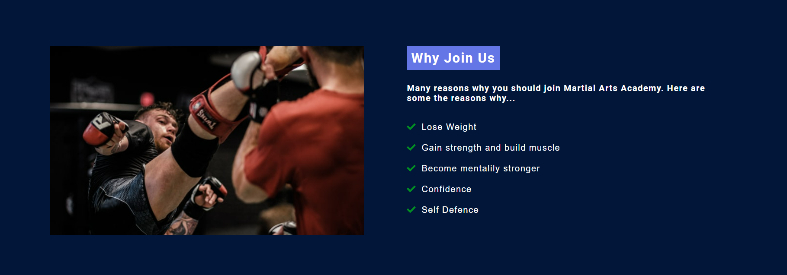

# Martial Arts Academy

Martial Arts Academy is a site for experienced or new martial arts practitioners. Main purpose of the site is to enable people to view the latest classes availble, check times of classes and join.

# Features

* Navigation Bar

    * The Navigation Bar is on all of the sites pages. 
    * It is fully responsive on all devices.
    * Link include Home, About us, Classes, Contact and Sign Up pages.
    * Logo is linked to home page.
    * This section allows our customers to easily navigate through the website.
    * Users can go to any page with ease of use as the Navigation bar is available on all pages.

    Landing Page Image

    * The image is fully responsive. 
    * Highlights what the website is about.
    * Has text overlay with call to action button.

* Benefits Section

    * This section is aimed at motivation people to take up Martial Arts.
    * It showcases brief benefits of what users can gain if they start Martial Arts.
    * Call to Action button to encourage users to Sign Up.
    * Image is there to motivate users and encourage them to take action.
    * The image is showing an indvidual exercising to show users what they can be gaining by joining the Academy.

* Popular Classes

    * This section shows users MA Academy's most popular classes.
    * It is aimed at getting users to see what the existing members of the Academy like.
    * Call to Action buttons are there to entice users to sign up or contact the Academy for more information.
    * Each class box has Instructors names so users can see what instructors in the Academy.
    * More information button directs users to Classes page where they can see full list of available classes.

* Testimonial Section

    * To show users existing customers reviews of MA Academy.
    * Encourage new users to Sign Up by showing them how happy existing customers are with the Academy.
    * Give users unbiased opinions of the Academy so they can make their mind up about joining.

* Footer 

    * Show users all the links to all pages available on the site.
    * Links to Social media accounts from MA Academy.
    * Logo with link to homepage so users can easily come back to sites home page.
    * Brief contact information of the Academy.

# Testing

* Validator Testing

    * HTML
    * CSS

* Responsive Testing

    Used Google devtools to resize the site to different breakpoints to test the responsiveness.

    * Breakpoints used: 1200px, 900px and 600px

# Depolyment

Deployment was completed using GitHub pages. The method used are as followed:

* Go to Martial Arts Academy Github repo.
* Go to settings page.
* Scroll to Pages section and click.
* Under source select Main. 
* Click Save. 

# Credits

* Fonts

    * All fonts was downloaded from Google Fonts using import links.

* Media
    
    * Hero images was taken from Pexels Royalty free image website.
    * Images for Home and Classes page was taken from Pixabay Royalty Free Image website.

* General

    * W3Schools
    * Stackoverflow
    * Google

* Wireframes

    * Wireframes was created using Balsamiq software.

# Testing

* W3C Validator
    
    * Validator showed error "The element a must not appear as a descendant of the button element." on line 28. Fixed error by removing button tag and adding custom css to a tag to create button.

